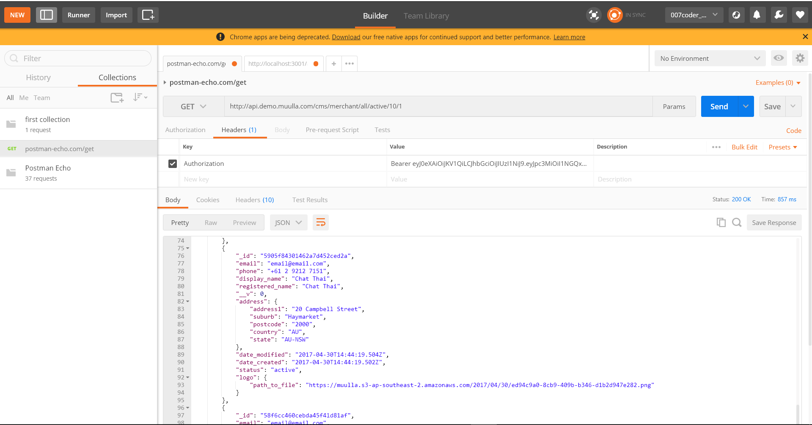

This project was bootstrapped with [Create React App](https://github.com/facebookincubator/create-react-app).

# FRONT-END WITH API, React

## Folder Structure

```
my-app/
  README.md
  node_modules/
  package.json
  public/
    index.html
    favicon.ico
  src/
    App.css
    App.js
    App.test.js
    index.css
    index.js
```
## Available Scripts

In the project directory, you can run:

### `npm start`

Runs the app in the development mode.<br>
Open [http://localhost:3000](http://localhost:3000) to view it in the browser.



